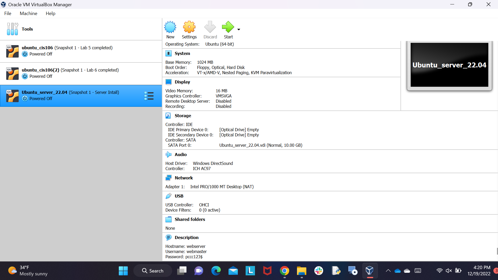
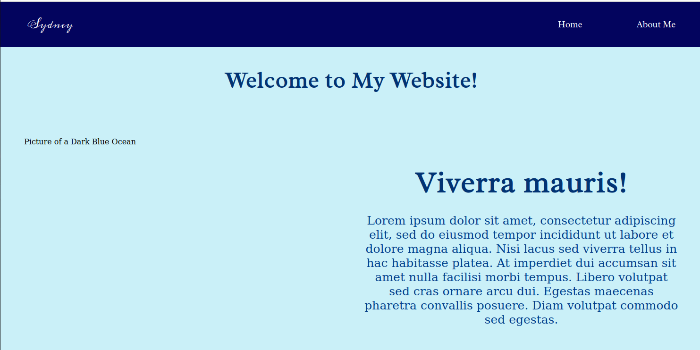

---
Sydney Gilmore
CIS106
---

# Final Deliverable

## Video 1

I had to create a separate vm (Ubuntu_22.04). In there, I created my username (webmaster) and hostname (webserver). The first image shows the specs of the new vm.

## Video 2

In the first image, I have successfully installed Apache with the command: `sudo apt intall apache2 -y`. In the second and third image, you can see that Apache is up and running. In the last image, I took a snapshot of my vm to save my progress of installing Apache.

## Video 3

I set up SSH between two of my vms (my regular one and the one I used to set up my user and hostname). I can now work on my website from my regular vm. However, for some reason, I still needed to use my ip to switch between servers. But personally, I don't mind copying and pasting my ip. And like always, I save my progress with a snapshot.  

## Video 4

I followed the final steps to host my website on Ubuntu. I enabled the virtual hosts, so that every time I search up my ip address, my website pops up in the sample format.

## Video 5

As a web dev major, I decided to take it upon myself to mess with HTML and CSS. The site may not be perfect, but I do like the outcome. Unfortunately, I couldn't get the image to show despite curling the image in my Ubuntu server. Either way, I still like how it turned out and the last image will show what the site would have looked like with the image. 

My website link "192.168.1.125"