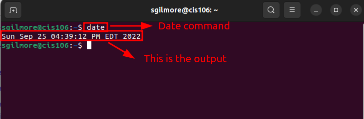
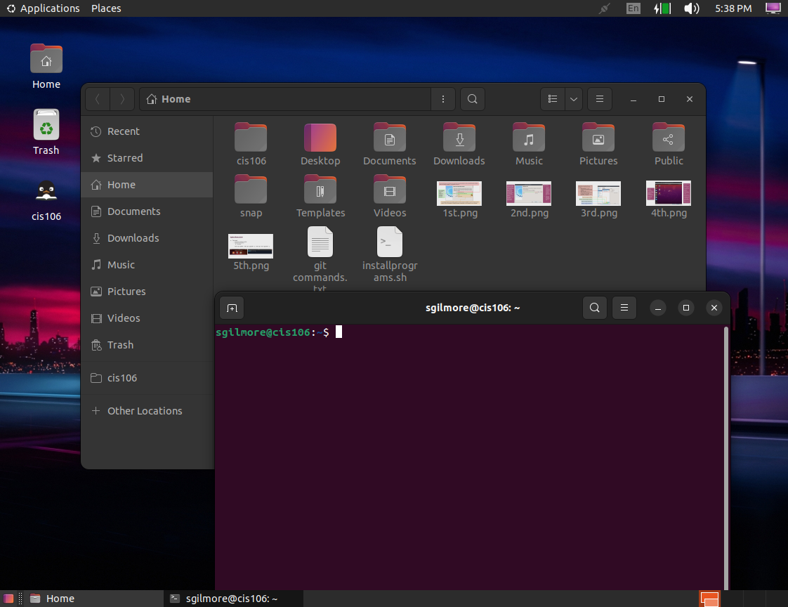

# Lab 3 Submission

## Question 1


## Question 2


## Question 3

| Program purpose     | Package Name | Version                     |
| ------------------- | ------------ | --------------------------- |
| Play a tetris game  | blockattack  | 2.7.0-1 amd64               |
| Play a video file   | dragonplayer | 4:21.12.3-0ubuntu1 amd64    |
| Browse the internet | dillo        | 3.0.5-7build1 amd64         |
| Read your email     | geary        | 40.0-2 amd64                |
| Play music          | deepin-music | 6.0.1.54+ds.1-2build1 amd64 |

### **CHALLENGE**
1. Install the programs that you found using a single command. Which command did you use?
   ```
       sudo apt install 'blockattack dragonplayer dillo geary deepin-music'
   ```
2. Remove all the programs that you installed in a single command. Which command did you use?
   ```
       sudo apt remove 'blockattack dragonplayer dillo geary deepin-music'
   ```
3. If you were to install the first and second program, but remove the other 3 in a single command, Which command will you use?
   ```
       sudo apt intall blockattack dragonplayer+ dillo geary deepin-music-
   ```

## Question 4

| command | what it does                                             |
| ------- | -------------------------------------------------------- |
| echo    | displays a line of text                                  |
| fortune | prints out a random/hopeful fortune                      |
| cowsay  | displays an ASCII image of cow saying whatever you wrote |
| lolcat  | adds a rainbow color text                                |
| figlet  | displays enlarged text made up of ordinary characters    |
| toilet  | displays colorful text                                   |
| rig     | Random Identity Generator                                |
