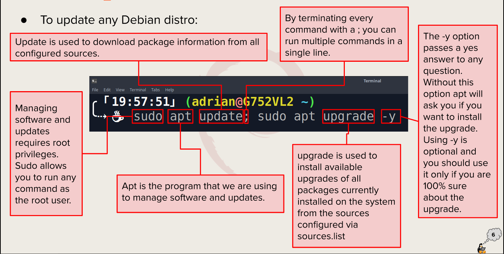

# Week Report 3

## Exploring Desktop Environments 
1. <u>Types of Desktop Environment</u>:
   - GNOME
   - KDE
   - XFCE
   - MATE
   - BUDGIE
   - LXDE
   - Cinnamon
   - Openbox
   - LXQT
   - Pantheon
   - Deeping DE
   - Fluxbox
  
2. <u> Definitions for the following terms</u>: GUI, DE
   - **Graphical user interface/GUI** -- is a set of programs that allows a user to interact with the computer system via icons, windows, and various of other visual elements

   - **Desktop Environment** -- an implementation of the desktop metaphor made of a bundle of programs running on top of a computer operating system, which shares a common GUI (sometimes described as a graphical shell)

2. <u> Common Elements of a Desktop Environment</u>:
   - Desktop Settings
   - Display Manager
   - File Manager
   - Icons
   - Favorites Bar
   - Launcher
   - Menus
   - Panels
   - System Tray
   - Widgets
   - Window Manager

## The bash Shell
1. What is a shell?
   **Shell** -- a program that provides interactive access to the operating system (OS)

2. <u> Different shells</u>:
   - Tcsh Shell
   - Csh Shell
   - Ksh Shell
   - Zsh Shell
   - Fish Shell

3. <u> Some Bash Shortcuts</u>: 
   - Ctrl + A -> Go to the start of the command line
   - Ctrl + E -> Go to the end of the command line
   - Ctrl + K -> Delete from cursor to the end of the command line
   - Crl + U -> Delete from the cursor to the start of the command line
   - Ctrl + Y -> Paste word or text that was cut using one of the deletion shortcuts after the cursor
   - Ctrl + L -> clear the screen
   - Ctrl + C -> terminate the command
   - Ctrl + H -> delete character before the cursor
  
4. <u> Basic Commands and their Usage</u>:
   - !! -> run the last command
   - !blah -> run the most recent command that starts with 'blah' 
   - !blah:p -> print out the command that !blah would run (also adds it as the latest command in the command history)
   - !$ -> the last word of the previous command
   - !$:p -> print out the word that !$ would substitute
   - !* -> the previous command except for the last word
   - !*:p - print out what !* would substitute
   

## Managing Software
1. Command for updating ubuntu
   >sudo apt update; sudo apt upgrade -y

2. Command for installing software
   >sudo apt install 'package name'
3. Command for removing software
    >sudo apt remove 'package name'
4. Command for searching for software
   >apt search "package name"
  - Definition of the following terms:
        - **Package** -- archives that contain binaries of software, configuration files, and information about dependencies
        - **Library** -- reusable code that can used by more than one function or program
        - **Repository** -- a large collection of software available for download
   

