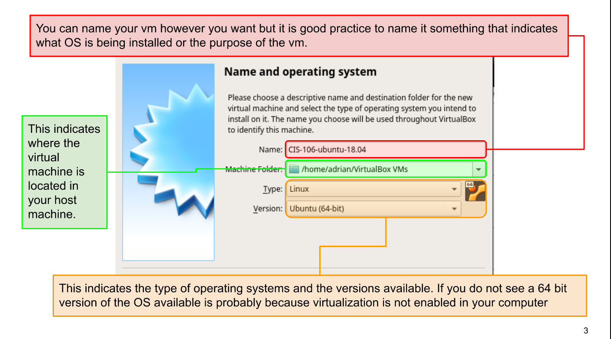
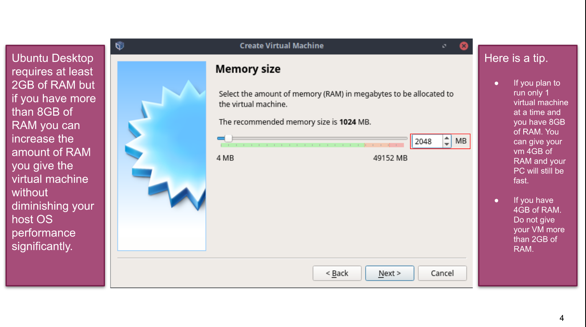
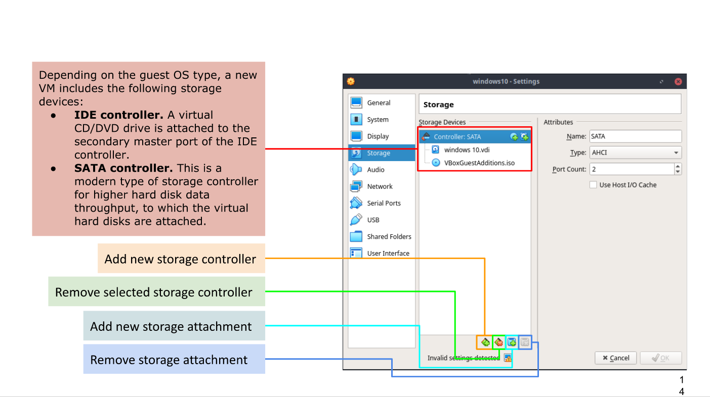
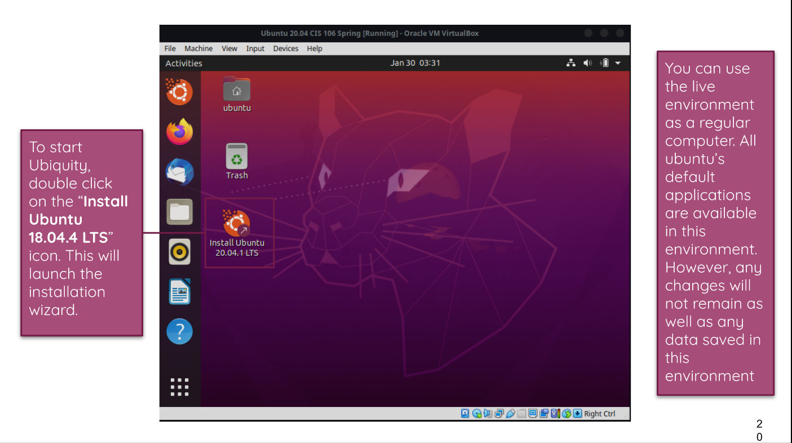
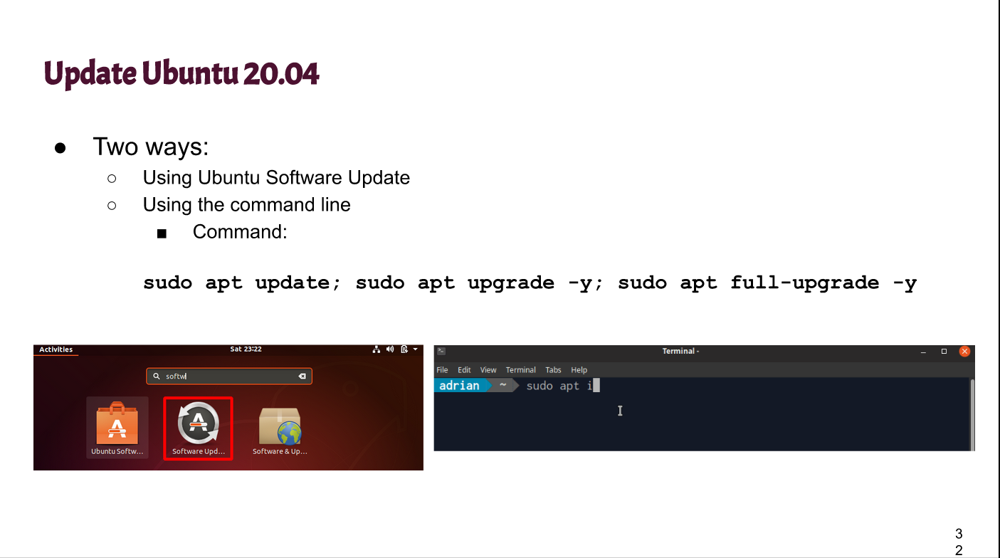

# Week Report 2

## The basics of virtualization

1. **What is virtualization?**
    Virtualization - replication of hardware to simulate a virtual machine inside a physical machine

2. **Types of Virtualization**
  There are two types: 
     - **Server side virtualization** provides a virtual desktop to each user. 
        .png)
     - **Client-side virtualization** is installed using software on a computer. Each virtual machine has it's own operating system and software applications.
    > The main difference between the two is ***where the virtualization occurs***
## Installing Ubuntu in Virtualbox
*Ubuntu Installation Process. In my opinion, these steps are important.

