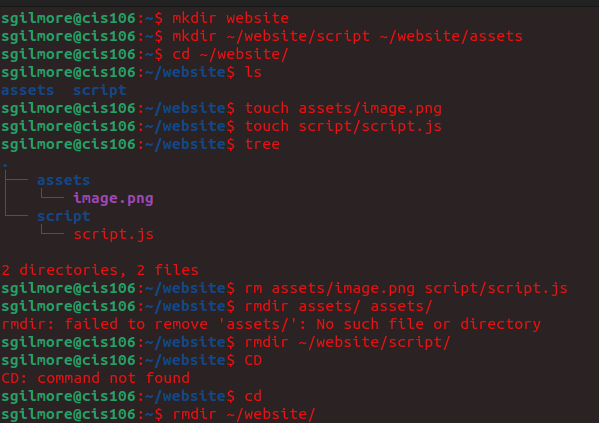
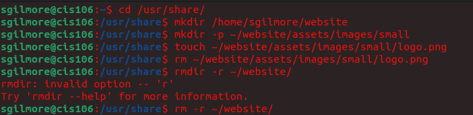
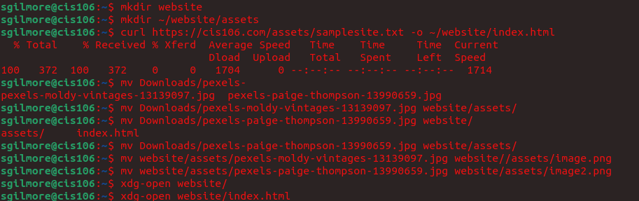
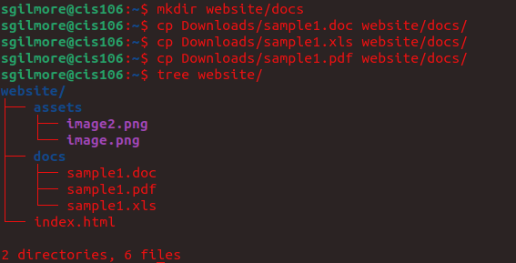

---
Sydney Gilmore
CIS 106
---

# Weekly Report 5

## What are Command Options?
Command Options modify/enhance their behavior

## What are Command Arguments?
Command Arguments are the items open that the command acts on

## Which command is used for creating directories? Provide at least 3 examples.
The command that creates directories is mkdir. To create a directory, type in the terminal the following: `mkdir + name of directory`
### Examples:
1. Create a directory in the present working directory
   - `mkdir wallpapers`
2. Create a directory in a different directory
   - `mkdir wallpapers/ocean`
   - `mkdir ~/wallpapers/forest`
3. Creating a directory with a space in the name
   - `mkdir wallpapers/new\ cars`
   - `mkdir wallpapers/'cities usa'`
4. Create a directory with a single quote in the name
   - `mkdir wallpapers/"majora's mask"`
5. Create multiple directories
   - `mkdir wallpapers/cars wallpapers/cities wallpaper/forest`
6. Create a directory with a parent directory at the same time
   - `mkdir -p wallpapers_others/movies`

## What does the touch command do? Provide at least 3 examples.
Touch is used for creating files. The create a file, type in the terminal the following: `touch + file name`
### Examples
1. Create a file called list
   - `touch list`
2. Create several files
   - `touch list_of_cars.txt script.py names.csv`
3. Creating using absolute/relative path
   - `touch Downloads/games2.txt`
   - `touch ~/Downloads/games2.txt`
4. Create a file with a space in its name
   - `touch "list of foods.txt`

## How do you remove a file? Provide an example.
The rm command is for removing files. To remove a file, type in the terminal the following: `rm + name of file`
### Examples
1. Remove a file and prompt confirmation before removal
   - `rm -i list`
2. Remove all the files inside a directory and ask before removing more than 3 files
   - `rm -I Downloads/games/*`

## How do you remove a directory and can you remove non-empty directories in Linux? Provide an example Provide an example
To remove an **empty** directory, use the following command in the terminal: `rmdir`
### Examples
1. Remove an empty directory
   - `rmdir Downloads/games`

To remove a **non-empty** directory, use the following command in the terminal: `rm -r`
### Examples
1. Remove a non-empty directory
   - `rm -r Downloads/games`

## Explain the mv and cp command. Provide at least 2 examples of each
<u> MV COMMAND</u>:
The mv command moves and renames directories. To move a directory, use the following command in the terminal: `mv + source + destination`
To rename a file, use the following command in the terminal: `mv + file/directory to rename + new name`
Source --> the file or directory you want to move
Destination -->  the place where the file or directory is going

### Examples
1. Move a file from a directory
   - `mv Downloads/homework.pdf Documents`
   - `sudo mv ~/Downloads/theme /usr/share/themes`
2. Move a file form one directory to another combining absolute path and relative path
   - `mv Downloads/english_homework.docx /media student/flashdrive/`
3. Rename a file using absolute path
   - `mv ~/Downloads/homework.docx ~/Downloads/cis106homework.docx`
4. Move *and* rename a file
   - `mv Downloads/cis106homework.docx Documents/new_cis106homework.docx`

<u>CP COMMAND</U>:
The cp command copies files/directories from a source ot a destination. To copy a file, use the following command in the terminal: `cp + files to copy + destination`

To copy directories, use the following command in the terminal: `cp -r + directory to copy + directory`
### Examples
1. Copy the content of a directory to another directory
   - `cp Downloads/wallpapers/* ~/Pictures`
2. To copy multiple files in a single command
   - `sudo cp -r script.sh program.py home.html assets/ /var/www/html/`

## Practices

### <u>Practice 1</u>:

### <u>Practice 2</u>:

### <u>Practice 3</u>:

### <u>Practice 4</u>:

