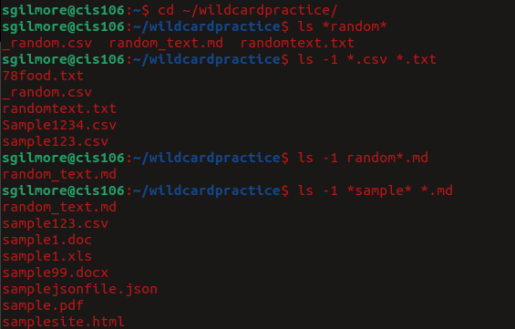
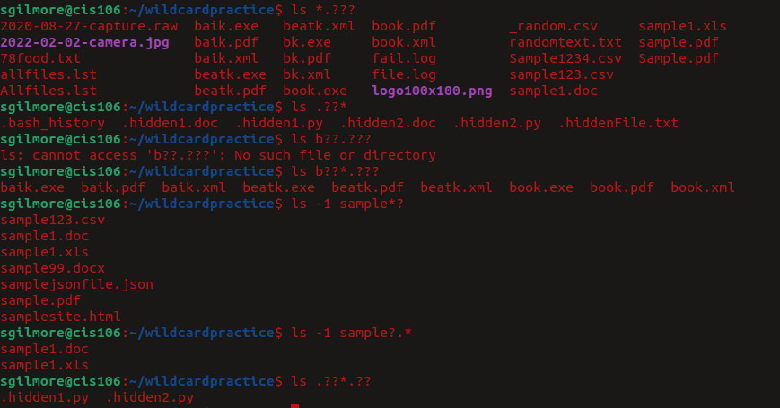

---
Sydney Gilmore
CIS 106
---

# Weekly Report 6

## Wildcards

### The * Wildcard
The * Wildcard matches form zero to any number of characters

#### Examples
- List all the files that end in .txt in a directory
  - `ls *.txt`
- List all the files that end in .txt and .pdf
  - `ls *.txt *.pdf`
- List all the files that start with the string "file", no matter its extension
  - `ls file.*`
- List all the files that have any letter before the string "file." and after as well
  - `ls *file.*`
  
### The ? Wildcard
The ? wildcard metacharacter matches **precisely one character**. Useful when working with hidden files (aka dot files)

#### Examples
- List all the hidden files in the current directory
  - `ls .??*`
- List all the files that have a two character between letter b and k
  - `ls b??k*`
- List all the files that have a single character between letter f and l
  - `ls f?l*`
- List all the files that have a 3 letter file extension
  - `ls *.???`

### The [] Wildcard
The [] wildcard will match a single character in a range. However, if it's combined with an !, it will do the opposite.

#### Examples
- Match all the files that have a vowel after letter f
  - `ls f[aeiou]*`
- Match all the files that have a range of letters after f
  - `ls f[a-z]*`
- Match all the files whose name has at least one number
  - `ls *[0-9]*`
- Match all the files who name **does not** have a number
  - `ls *[!0-9]*`
- Match all the files whose name begins with a letter from a-p or start with letters s or c
  - `ls [a-psc]*`
- Match all files whose name begins with any of these two sets of characters
  - `ls [a-fp-z]*`
- Match all the files whose name begins with any 3 combination of numbers and the current user's username
  - `ls [0-9][0-9][0-9]$USER`
  
## Brace Expansion
This is **NOT** a wildcard but another feature of bash that allows you to generate arbitrary strings to use with commands

### Examples
- To create a while directory structure in a single command
  - `mkdir -p music/{jazz,rock}/{mp3files,videos,oggfiles}/new{1..3}`
- To create N number of files use:
  - `touch website{1..5}.html`
  - `touch file{A..Z}.txt`
  - `touch file{001..10}.py`
  - `touch file{{a..z},{0..10}}.js`
- Remove mutiple files in a single directory
  - `rm -r {dir1,dir2,dir3,file.txt,file.py}`

## Practices

### Practice 5

### Practice 6

### Practice 7
.png)
.png.png)